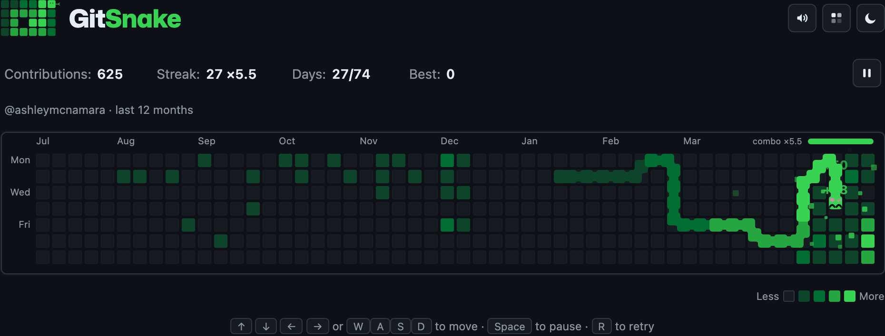
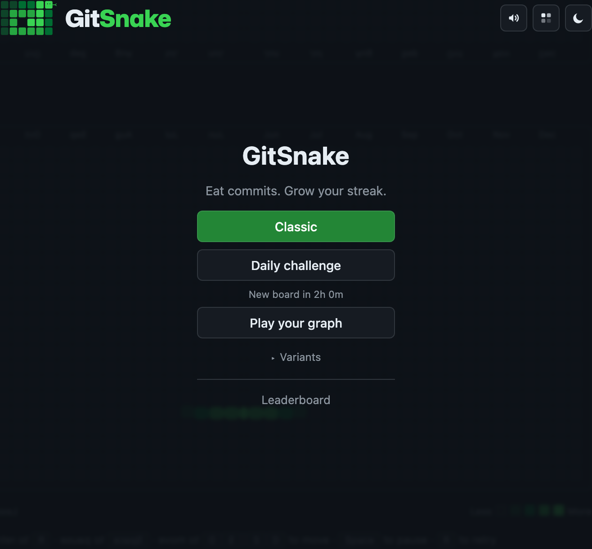

# GitSnake

Snake, but the food is your GitHub contributions. Type in any username and eat your way across a real twelve-month commit graph — brighter days are worth more points, and a good combo streak stacks up fast.

**Play it at [yetanothersnake.dev](https://yetanothersnake.dev).**

<p align="center">
  
</p>

## How to play

Steer with the arrow keys or `WASD` — swipe or use the on-screen D-pad on a phone. Drive the snake into glowing commit cells to grow and score, and keep eating without pausing to build up a combo multiplier. Run into a wall or your own tail and it's over. `Space` pauses, `R` gives you an instant rematch.

Three ways to play:

- **Classic** — play the ranked endless board, work through a five-level maze campaign, or raid real archived contribution years in the Legends archive. Rebase, Fork, and Squash power-ups can rescue a crash, double a scoring run, or trim a dangerous tail.
- **Daily challenge** — everyone gets the *same* board, gameplay modifier, and objective each day, and the day's top ten race alongside you as translucent ghosts. Only your first run counts, so make it good.
- **Play your graph** — punch in any GitHub username and play their real last-twelve-months graph. Eat the whole year to win.

<p align="center">
  
</p>

Along the way there are golden commits for bonus points, achievements to unlock, and server-verified leaderboards (all-time, today's daily, a local friends view, and one per graph). Daily results copy as a compact five-tile challenge card. Daily streaks, completed objectives, and campaign clears unlock snake skins, grid themes, and trails in the Locker. Click any leaderboard score to watch the run back, or export it as a video clip to share. There's also a handful of just-for-fun unranked variants: wrap-around walls, chill speed, rotten commits, and racing your own best ghost.

## Under the hood

The fun part is that it's deliberately old-school. No React, no framework, no build-time magic — just vanilla JavaScript, an HTML canvas, and Vite. The entire thing ships with **three runtime dependencies**.

The bit I'm proudest of is how scores stay honest. The game core in [`src/game/core.js`](src/game/core.js) is fully deterministic, and the *same file* runs in the browser and on the server. When you play, the server hands you a seeded game and your browser records every input; on submit, the server replays those inputs through that identical core and scores what actually happened. So there's nothing to trust from the client — the only way to fake a great score is to genuinely play a great game.

A few other things I like:

- **Storage-agnostic backend** — Netlify Functions and Netlify Blobs in production, SQLite for local dev, all behind one small interface.
- **Installable PWA** that works offline.
- **GitHub-accurate visuals** — light and dark themes plus a colorblind-safe palette, and a follow-camera so the wide graph board still fits on a phone.
- **Actually tested** — unit tests with Vitest and end-to-end tests with Playwright.

## Run it yourself

```bash
npm install
npm run dev      # play at http://localhost:5173
npm test         # run the unit suite
```

No database or API keys to set up for local play (a `GITHUB_TOKEN` is optional — it just swaps the public-page scrape for GitHub's official API). It deploys to Netlify, or any Node host, out of the box.

## License

MIT — see [LICENSE](LICENSE).
